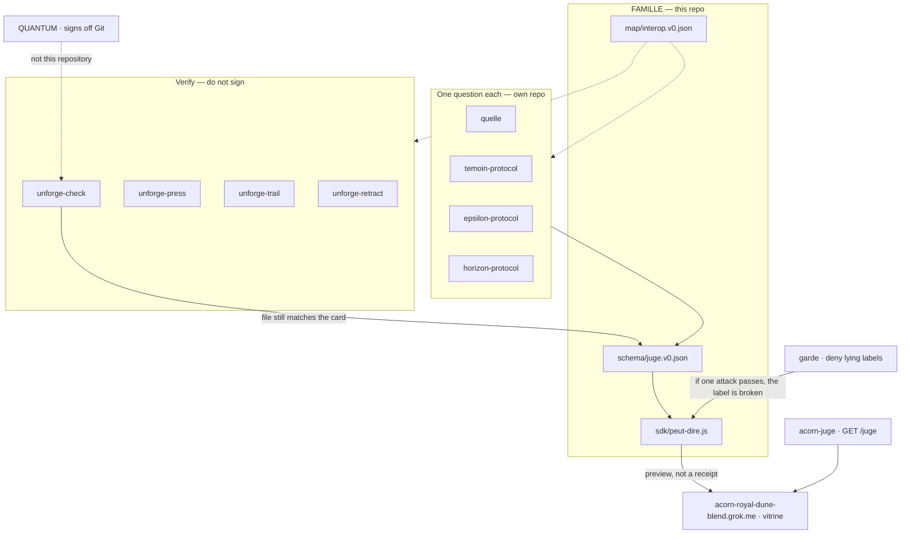

# FAMILLE

**The map — not a rail.**

A typed-evidence lattice for post-quantum cybersecurity and composable proof.
Not fourteen scripts. Not a blockchain. Not a coin.

Before anyone may say *quantique*, four fields must hold on the card.
A missing field keeps the label **classique**. That is the product.

**Carte citée :** https://acorn-royal-dune-blend.grok.me
Un seul hôte. Voir [HOTE.md](HOTE.md). Titre public : Famille.

## Four fields

| Field | Question | Honest default |
|---|---|---|
| `quelle` | Where did the bits come from? | `os` (phone entropy) |
| `temoin` | With what force? | `aucun` |
| `epsilon` | What error margin? | must be a number **> 0** |
| `horizon` | Until which calendar day? | `YYYY-MM-DD` — never `UFHY1` |

`mode` is not a fifth field. **MODE is the collapse** of the four.

```js
import { peutDire } from './sdk/peut-dire.js'

peutDire({ quelle: 'os', temoin: 'aucun', epsilon: null, horizon: '' })
// { quantique: false, mode: 'classique', manques: ['epsilon','horizon'], preview: true }
```

```bash
npm test
node sdk/cli.js examples/attest-os.json   # exit 2 = classique — correct
```

This repo **consumes** the card. It does not sign. QUANTUM stays off Git.

## Architecture

Fields on a stage. Source → channel → bound → check → read.
The seal is elsewhere.



Machine table of the same edges: [`map/interop.v0.json`](map/interop.v0.json).

## How this map talks to siblings

Siblings stay siblings. FAMILLE does not vendor them.

| Node | Repo | Talks to the map by |
|---|---|---|
| Protocol v0s | [quelle](https://github.com/carllaliberte/quelle) · [témoin](https://github.com/carllaliberte/temoin-protocol) · [epsilon](https://github.com/carllaliberte/epsilon-protocol) · [horizon](https://github.com/carllaliberte/horizon-protocol) · [mode](https://github.com/carllaliberte/mode-protocol) · [bruit](https://github.com/carllaliberte/bruit-protocol) · [figure](https://github.com/carllaliberte/figure-protocol) · [situs](https://github.com/carllaliberte/situs-protocol) · [recu](https://github.com/carllaliberte/recu-protocol) · [dossier](https://github.com/carllaliberte/dossier-protocol) | emit or read the same four keys |
| unforge-check | [check](https://github.com/carllaliberte/unforge-check) | file + `.unforge.json` still match |
| unforge-press / trail / retract | [press](https://github.com/carllaliberte/unforge-press) · [trail](https://github.com/carllaliberte/unforge-trail) · [retract](https://github.com/carllaliberte/unforge-retract) | print, itinerary, signed withdrawal |
| acorn-juge | [canal](https://github.com/carllaliberte/acorn-juge) | Worker `GET /juge` — display, not a second grok.me |
| garde | [garde](https://github.com/carllaliberte/garde) | attacks that must deny |
| formal-layer | [formal-layer](https://github.com/carllaliberte/formal-layer) | admitted obligations, not theorems |

AI agents read the same JSON. They call `peutDire`. They are not the judge.

Out of this map: `contract`, CreatorFlow, Estoc, filon-spec, QUANTUM.

## Named suites — not « quantum-safe »

| Suite | Claim |
|---|---|
| `ed25519` | Shor is not yet assumed at this size |
| `UFHY1` | Ed25519 + ML-DSA-65 — both verify today |
| `mldsa87` | elliptic is no longer trusted |

Threat model: harvest-now-decrypt-later. HORIZON expires the hypothesis.
Do not write « formally verified ». See [FORMAL.md](FORMAL.md).

## What this is not

A bot, a rail, a bank, a mint, a second grok.me, a photon in the index.
ε = 0 is a lie. UFHY1 is not a date. Preview ≠ quittance.

See [INTERDIT.md](INTERDIT.md) · [JUGE.md](JUGE.md) · [CURSOR.md](CURSOR.md).

© 2026 Carl Laliberté. MIT for listed protocols. Estoc stays off the file. QUANTUM stays off Git.
